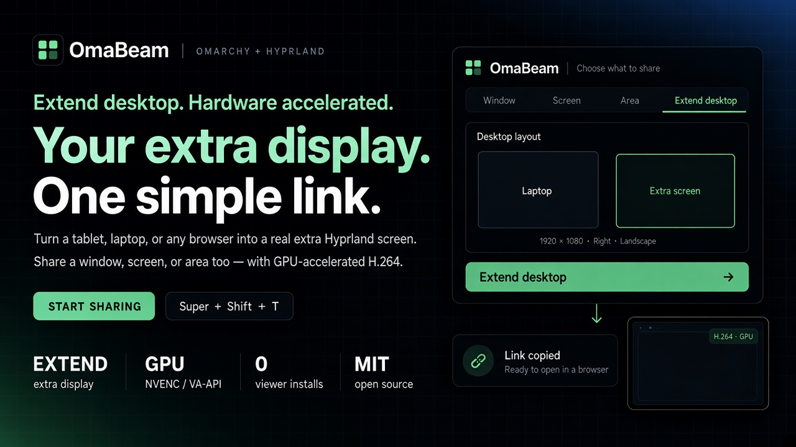

# OmaBeam

**Turn any browser into an extra display. Share a window, screen, or area
over one local-network link.**

OmaBeam is a screen-sharing plugin for Omarchy and Hyprland. Use a tablet,
laptop, or another device as an extra desktop, or share what is already on
screen. Preview your selection, start sharing, and open the link on another
device. Browser viewers do not need an app.

- **Extend your desktop** with a browser display in landscape or portrait.
- **Share a window, screen, or area** with hardware-accelerated H.264 and
  automatic JPEG fallback.
- **Share the link** by clipboard, QR code, or a nearby OmaSend or LocalSend device.
- **Take screenshots** to copy, save, or send.
- **Control the share from the bar:** see viewers, reopen the link, or stop.

[Install](#install) · [Share your screen](#share-your-screen) ·
[Extend your desktop](#extend-your-desktop) · [Troubleshooting](#troubleshooting) ·
[Development](docs/DEVELOPMENT.md)

## Install

Run this in a terminal as your normal desktop user on Omarchy:

```bash
curl -fsSL https://raw.githubusercontent.com/cfaulkingham/omabeam/main/install-release.sh | bash
```

The [installer](install-release.sh) installs the prebuilt `omabeam-bin` package
and its dependencies, then enables the bar plugin and desktop integration.
It includes the hardware encoder and experimental Google Cast helper. No Rust
or Cast SDK build is needed. It prompts for sudo and package confirmation;
network access is configured by the usual plugin installer. Run the same command
again to update. Existing Git-managed plugin installs must be removed with
Omarchy's plugin commands before switching to this package.

Supports x86_64 and experimental ARM64 on an existing compatible Omarchy
installation. Viewers need a browser and access to the host on the local network.

### From source

Install Git, a current stable Rust toolchain, and the
[native build dependencies](docs/DEVELOPMENT.md#build-and-run), then:

```bash
omarchy plugin add https://github.com/cfaulkingham/omabeam.git
cd "${XDG_CONFIG_HOME:-$HOME/.config}/omarchy/plugins/io.github.cfaulkingham.omabeam"
./install.sh
```

Already have a source checkout? Run `./install.sh` from that directory.

The installer builds the app, installs and enables the bar plugin, adds
floating-window rules for the picker and nearby-send window, and binds
**Super + Shift + T** if the shortcut is available. It can be rerun. Portal
picker configuration is optional and stays unchanged.

Hardware encoding needs the `ffmpeg` package and compatible NVIDIA, Intel, or
AMD drivers. If the hardware helper cannot build or run, OmaBeam can still use
software H.264.

For a plugin-only source install, run these commands inside the installed
plugin checkout instead of the full installer:

```bash
./install.sh --backend-only
omarchy plugin enable io.github.cfaulkingham.omabeam --section right
```

This builds the app without adding window rules or a keyboard shortcut.

### From a compiled bundle

Download the archive for your architecture and its `.sha256` file from
[GitHub Releases](https://github.com/cfaulkingham/omabeam/releases/latest).
Verify the checksum, extract the archive, enter the
`io.github.cfaulkingham.omabeam` directory, and run:

```bash
./install.sh
```

No Rust toolchain is needed. Use a bundle matching your machine's architecture
and runtime libraries. Release bundles target Omarchy on x86_64 and experimental
ARM64, and include the hardware encoder and experimental Google Cast helper.
ARM64 requires an existing compatible Omarchy installation. For a plugin-only bundle install, copy the extracted
directory into `${XDG_CONFIG_HOME:-$HOME/.config}/omarchy/plugins/`, then run
`omarchy-shell shell rescanPlugins` and the enable command above.

### Arch / AUR packaging

The ready-to-use [PKGBUILD](packaging/aur/PKGBUILD) downloads the matching
prebuilt archive from GitHub Releases and verifies its checksum. To install
`omabeam-bin` on Omarchy without compiling Rust or the Cast SDK:

```bash
git clone https://github.com/cfaulkingham/omabeam.git
cd omabeam/packaging/aur
makepkg -si
```

Then enable the plugin as your desktop user:

```bash
bash /usr/share/omabeam/plugin/install.sh
```

Run it again after package upgrades to refresh the bar plugin. Pacman manages
the app, encoder and Cast binaries; this installer configures the user plugin,
desktop integration and network access. The package has not yet been submitted
to AUR. See [AUR packaging](RELEASING.md#aur-binary-package) for building and
publishing the package.

### Network access

Browser sharing uses TCP **9847** for the viewer page and JPEG, and UDP
**9848** for H.264/WebRTC. During installation, OmaBeam checks UFW for access
from the detected LAN. If blocked, it prompts for sudo to add persistent rules
scoped to that subnet. A normal install still succeeds if you decline sudo
or the firewall cannot be verified.

Run these from the source, bundle, or installed plugin directory to check
without rebuilding. The first command does not change rules; the second
allows your chosen viewer network. Replace the example subnet with your own:

```bash
./install.sh --check-ports
./install.sh --check-ports --open-firewall 192.168.2.0/24
```

Use `--check-ports --subnet 192.168.2.0/24` to inspect a specific network
without changing rules. Explicit check/open requests fail if access remains
blocked or unverified. Rules persist after plugin removal. UFW checks do not
verify Wi-Fi client isolation, other firewall managers, or end-to-end access;
test a share from your viewing device afterward. See
[firewall check details](docs/DEVELOPMENT.md#firewall-checks).

Links contain a fresh random token. Anyone on the LAN with the link can view
the share. The viewer page and JPEG use plain HTTP, so use a trusted network.

### Update

Stop active shares before updating. For a Git-managed installation:

```bash
omarchy plugin update io.github.cfaulkingham.omabeam
cd "${XDG_CONFIG_HOME:-$HOME/.config}/omarchy/plugins/io.github.cfaulkingham.omabeam"
./install.sh --backend-only
```

If you enabled Google Cast, add `--with-cast` when rebuilding. To update a
bundle installation, verify and extract the new bundle and rerun its
`./install.sh`. The installer refuses to overwrite a Git-managed installation
from another directory; update that checkout instead.

For `omabeam-bin` installations, update the package and rerun
`bash /usr/share/omabeam/plugin/install.sh` to refresh the user plugin.

## Share your screen

1. Open OmaBeam from the bar or **Super + Shift + T**.
2. Choose **Window**, **Screen**, or **Area**, then check the preview.
3. Choose a quality preset and whether to include the cursor.
4. Select **Start sharing**. The picker closes and copies the browser link.
5. Open the link on your other device. The bar panel can also show a QR code
   or **Send nearby** to an OmaSend or LocalSend receiver.

Window capture follows the selected window even when another window overlaps
it. If separate window capture is unavailable, choose an area explicitly.
Closing the source ends the share. For area selection, drag to select, hold
**Shift** for a square, or hold **Space** to move the selection.

The browser offers pause/resume, snapshots, fullscreen, and fit controls.
Regular shares support multiple viewers. Stop sharing from the bar when done;
closing a viewer alone does not stop the host share.

Nearby sending requires a LocalSend-compatible app on the receiving device.
If it requires a PIN, the send window asks for it. OmaBeam only sends links;
it does not appear as a receiving device.

### Quality and video

Choose **Balanced**, **Crisp text**, or **Smooth motion**. Crisp text uses
native pixels for fine detail on scaled displays; native pixels can use more
CPU and bandwidth. **Advanced** lets you adjust frame rate, maximum width,
pixel detail, encoder, and bitrate. The picker remembers your stream settings.

H.264 / WebRTC is the default. **Auto** encoding tries the GPU and falls back
to software if needed. The browser falls back to JPEG if H.264 cannot play.
Choose **Video transport → JPEG** in the picker to use JPEG directly. In the
viewer, **Video: Auto** switches to JPEG, and **Video: JPEG** tries Auto again.

## Extend your desktop

1. Open OmaBeam and choose **Extend desktop**.
2. Choose a resolution, 100% or 200% scale, landscape or portrait, and placement
   beside your existing screens. Check the layout preview.
3. Click **Extend desktop**, then open the copied link or bar-panel QR code on
   your other device.
4. Move windows onto the extra display with your Omarchy computer's mouse and
   keyboard. The browser displays them; input stays on the host computer.

The extra display starts empty. Any windows or notifications placed there
become visible to the viewer. It defaults to native pixels, a visible host
cursor, and 60 FPS; an explicitly chosen frame rate or preset takes precedence.

Choose **Match this device** in the viewer to fit the desktop to its viewing
area, including fullscreen and orientation changes. OmaBeam selects 100% or
200% scale for the device. Choose **Device size: On** again to restore the
host's settings. The preference survives a refresh of that tab. Supported
sizes run from 640×480 up to 3840×2160 or portrait. Tap the picture if the
browser needs a gesture to enter fullscreen.

An extended display accepts **one active browser client**. Refreshing the tab
keeps its place. Pausing, closing, or losing the client reserves its place for
15 seconds before another device can connect.

Stop sharing from the bar to remove the extra display and return its
workspaces to your remaining monitors. Closing the viewer leaves the display
available for reconnection. Removing the display reloads your Hyprland
configuration, which also resets monitor settings changed only at runtime.
If cleanup fails, use `--stop` again as shown under [Command line](#command-line).

## Screenshots and keys

Select **Screenshot** for Copy, Save, or LocalSend actions. Saved captures go
to an `omabeam/` subdirectory under `OMARCHY_SCREENSHOT_DIR`, then
`XDG_PICTURES_DIR`, then `~/Pictures`, using the first available setting.
PNG screenshots keep the capture resolution.

| Control | Action |
| --- | --- |
| Arrows or `h j k l` | Select a source or panel action |
| `Tab` / `Shift+Tab` | Move between controls |
| `Ctrl+Tab` / `Ctrl+Shift+Tab` | Switch Window, Screen, Area, Extend desktop |
| `Enter` | Start sharing; copy in Screenshot mode; confirm in portal mode |
| `c` / `s` / `f` | Copy / save / share a screenshot |
| `v` | Start live sharing |
| `?` | Toggle keyboard help |
| `Esc` | Close or cancel |

In the bar panel, `c` copies the link, `o` opens the viewer, `n` sends nearby,
`q` shows the QR code, and `r` refreshes status.

## Experimental Google Cast

To enable video-only mirroring to a Google Cast receiver, build the optional
helper from your installed source checkout:

```bash
./install.sh --backend-only --with-cast
```

The first build downloads several gigabytes of dependencies and toolchain files
into `${XDG_CACHE_HOME:-$HOME/.cache}/omabeam/cast`. It also needs the
[C/C++ build dependencies](docs/DEVELOPMENT.md#build-and-run), Python 3, Git,
and pkg-config. Browser sharing does not need this helper.

Choose **Google Cast** and a receiver in the picker. Available profiles are
720p and 1080p at up to 30 FPS, subject to receiver limits. The bar shows the
receiver and a Stop action; no browser link is needed. System audio is not
supported. Compatibility and sustained performance are still being qualified;
see [current device results](docs/NATIVE-CAST-STATUS.md).

## Use as a portal picker

Set the launcher in `~/.config/hypr/xdph.conf`, substituting your home directory
or custom config location:

```conf
screencopy {
    allow_token_by_default = true
    custom_picker_binary = /home/YOU/.config/omarchy/plugins/io.github.cfaulkingham.omabeam/omarchy-plugin/omabeam
}
```

Restart `xdg-desktop-portal-hyprland` or log out and back in to apply it.

## Command line

The launcher is installed inside the plugin directory. Run it directly:

```bash
cd "${XDG_CONFIG_HOME:-$HOME/.config}/omarchy/plugins/io.github.cfaulkingham.omabeam"
./omarchy-plugin/omabeam --help
./omarchy-plugin/omabeam --status
./omarchy-plugin/omabeam --send-link
./omarchy-plugin/omabeam --stop
```

`--status` prints session JSON, `--send-link` opens nearby devices for the
active share, and `--stop` ends sharing, including a session still starting.
To open the picker with custom settings or create an extended display:

```bash
./omarchy-plugin/omabeam --fps 30 --width 1280 --h264-bitrate 4000000
./omarchy-plugin/omabeam --native-pixels --cursor --live extend 1920 1080 1 right
```

The extended-display values are width, height, scale (`1` or `2`), and placement
(`right`, `left`, `above`, or `below`). Dimensions must divide evenly by the
scale. A share started with `--live` stops when you press Ctrl-C or close that
terminal; on Linux, `nohup` keeps it running. Use `--bind 127.0.0.1` for viewing
only on this computer, or forward the HTTP port over SSH for JPEG viewing.

## Troubleshooting

- **The viewer cannot connect:** check that both devices can reach each other
  on the LAN, then run the [network checks](#network-access).
- **JPEG works but H.264 times out:** check UDP 9848. A custom `--port` or
  `--webrtc-port` needs its own firewall rule.
- **Sharing uses software encoding:** check `ffmpeg` and your GPU drivers.
  Open **Stream diagnostics** in the viewer for the selected encoder and
  fallback reason. See [encoder checks](docs/DEVELOPMENT.md#encoder-checks)
  for a capture-free diagnostic.
- **The extra display is busy:** close or pause its other viewer and wait
  15 seconds before connecting from another device.
- **The extra display remains after a crash:** run the installed launcher's
  `--stop` command again to retry cleanup.
- **A Cast receiver is missing or cannot connect:** follow the
  [Cast network checks](docs/NATIVE-CAST-STATUS.md#network-checks). Browser
  firewall checks do not cover Cast discovery or media traffic.

Session logs are in `$XDG_RUNTIME_DIR/omabeam/live.log`. A static screen can
report 0 capture FPS while waiting for changes; this alone is not a failure.

## Remove

Stop sharing and remove the installer-added desktop rules **before** removing
the plugin:

```bash
cd "${XDG_CONFIG_HOME:-$HOME/.config}/omarchy/plugins/io.github.cfaulkingham.omabeam"
./omarchy-plugin/omabeam --stop
./install.sh --remove-desktop
omarchy plugin remove io.github.cfaulkingham.omabeam
```

Skip `--remove-desktop` if you used only `--backend-only` or copied a bundle
without running the full installer. If removing the rules by hand, delete the
blocks marked `-- omabeam (install.sh)` from `hyprland.lua` and `bindings.lua`,
then reload Hyprland. Removing the plugin alone does not stop a detached share.

If you installed `omabeam-bin`, also remove the system package with
`sudo pacman -R omabeam-bin` after removing the user plugin.

Screenshots, `~/.config/omabeam/` (saved settings and the LocalSend identity),
firewall rules, and any portal-picker configuration remain. `XDG_CONFIG_HOME`
overrides `~/.config`. Session files under `$XDG_RUNTIME_DIR/omabeam/` disappear
at logout.

## Development

See the [development guide](docs/DEVELOPMENT.md) for builds, architecture,
protocol behavior, diagnostics, and tests, and [release documentation](RELEASING.md)
for packaging and publishing.

MIT licensed. LocalSend retains its own license and
[upstream provenance](vendor/localsend/UPSTREAM.md).
