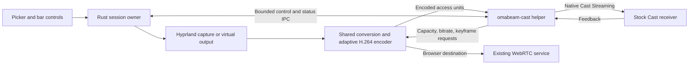

# Native Google Cast screen mirroring

Development plan — 2026-09-23. The video implementation is on
`codex/native-google-cast`; see [implementation and qualification status](NATIVE-CAST-STATUS.md).
Initial physical playback is confirmed; full device qualification remains
outstanding. The milestones below retain their original acceptance gates;
local software tests do not clear those gates.

## Outcome and scope

Add a **Google Cast** destination to OmaBeam. The user selects a receiver and
shares a window, screen, region, or extended Hyprland desktop. OmaBeam sends
captured frames using native Cast Streaming to the receiver's existing
mirroring application. The host's mouse and keyboard remain the input devices.

The first beta targets one video-capable receiver per session on the local
network, Linux/Omarchy, SDR, and 720p30 or 1080p30 where supported. Preserve the
current browser destination and its WebRTC/JPEG behavior. Ship video first;
system audio has its own milestone below. Evaluate 1080p60 after the baseline
passes. Receiver support must be stated by tested model and firmware.

Native mirroring is the acceptance criterion. Playing an HLS URL, launching the
Default Media Receiver, casting a Chrome tab, or requiring a custom receiver
application does not fulfill this feature. If stock-receiver mirroring fails,
record the blocker and revise the implementation approach explicitly. Do not
quietly substitute media playback.

Initial exclusions: receiving casts into OmaBeam, simultaneous browser and Cast
output, multiple Cast receivers, remote input injection, protected-content
capture, HDR, 4K guarantees, and a fully offline guarantee. Test WAN dependencies
of receiver launch rather than assuming that local media transport means no
Internet dependency. macOS continues to support synthetic development demos;
this project does not currently capture the Mac desktop.

## Evidence and the first technical decision

Use **Open Screen/libcast in a separate C++ helper** as the starting architecture.
Rust retains capture, pixel conversion, encoding, session ownership, and UI. The
helper owns discovery, device authentication, receiver application control,
Cast negotiation, encryption, and RTP/RTCP transport. This follows the existing
isolated encoder-helper pattern and avoids a C++ ABI dependency in the main app.

Open Screen sources were inspected at revision
[`8b108491d2696309ca37ac0d3260bf423e773e8b`](https://chromium.googlesource.com/openscreen/+/8b108491d2696309ca37ac0d3260bf423e773e8b).
This is a research reference, not a claim that the revision builds or works with
our receivers. Select and lock a tested revision, its DEPS, toolchain, and local
patches in milestone 0.

Important findings:

- The current standalone sender's [source and CLI](https://chromium.googlesource.com/openscreen/+/8b108491d2696309ca37ac0d3260bf423e773e8b/cast/standalone_sender/main.cc)
  include H.264 and HEVC. Its usage guide still lists only VP8/VP9/AV1. H.264
  reuse is plausible; an actual receiver must prove it.
- The [reference agent](https://chromium.googlesource.com/openscreen/+/8b108491d2696309ca37ac0d3260bf423e773e8b/cast/standalone_sender/looping_file_cast_agent.cc)
  launches the streaming application and calls `SenderSession::Negotiate()`;
  it also supports an offer with video and no audio. Use this mirroring path,
  not `NegotiateRemoting()` or media-URL loading.
- The upstream [application-ID helper](https://chromium.googlesource.com/openscreen/+/8b108491d2696309ca37ac0d3260bf423e773e8b/cast/common/public/cast_streaming_app_ids.h)
  identifies the Chromium audio/video streaming application as `0F5096E8`.
  Use the upstream accessor and test availability; the value is not a universal
  compatibility promise or a reason to register our own receiver.
- [`Sender`](https://chromium.googlesource.com/openscreen/+/8b108491d2696309ca37ac0d3260bf423e773e8b/cast/streaming/public/sender.h)
  accepts encoded frames and handles transport feedback. It provides flow
  control, but the embedding application must implement congestion control.
- [`SenderSession`](https://chromium.googlesource.com/openscreen/+/8b108491d2696309ca37ac0d3260bf423e773e8b/cast/streaming/public/sender_session.h)
  provides negotiated senders, capture recommendations, errors, and an estimated
  network bandwidth. Renegotiation invalidates the previous configured senders.
- The [standalone sender build](https://chromium.googlesource.com/openscreen/+/8b108491d2696309ca37ac0d3260bf423e773e8b/cast/standalone_sender/BUILD.gn)
  is marked `testonly`. Treat it as a feasibility tool and reference; create a
  production helper target against the library rather than shipping the demo.

## Where the work fits today

| Existing component | Reuse and required change |
| --- | --- |
| [Capture crate](../crates/omabeam-capture/src/lib.rs) | Reuse source capture and generated demo frames; no new portal workflow needed. |
| [H.264 worker](../src/live/webrtc/encoder.rs) | Extract conversion and adaptive encoding from the WebRTC module. Its worker currently depends on WebRTC connections, metrics, keyframe flags, and queue state. |
| [Encoder protocol](../crates/omabeam-encoder/src/lib.rs) and [FFmpeg backend](../crates/omabeam-encoder/src/video.rs) | Reuse bounded I420 input and Annex B output. Add explicit codec constraints and runtime bitrate updates; current helper configuration is fixed at startup. |
| [Live session](../src/live.rs) and [frame state](../src/live/state.rs) | Separate source, destination, and media settings. Currently an HTTP URL identifies the session, HTTP always starts, and raw frames/viewer demand depend on WebRTC. |
| [Virtual output](../src/hypr/desktop.rs) and [desktop control](../src/live/desktop.rs) | Reuse ownership, resize rollback, cleanup, and recovery. Replace browser lease dependence with an explicit Cast owner for Cast sessions. |
| [Status persistence](../src/live/status.rs) and [bar state](../omarchy-plugin/Session.js) | Add destination and connection state while retaining bounded status and legacy parsing. Stop identifying sessions by URL. |
| [Native picker](../src/app.rs), [settings](../src/app/settings.rs), [bar panel](../omarchy-plugin/ShareContent.qml) | Add destination selection and Cast progress; keep browser-link actions conditional on a browser destination. |
| [Packaging](../scripts/package-plugin.py), [installer](../install.sh), [CI](../.github/workflows/ci.yml), [release workflow](../.github/workflows/package.yml) | Build, verify, bundle, and diagnose the additional native helper and its dependencies. |

## Architecture and contracts

The two output branches are alternative destinations in the first release.
Do not build a multi-output encoder scheduler as a prerequisite.

### Rust session and encoder boundary

Introduce `Destination::Browser` and `Destination::Cast { receiver_id, ... }`,
keeping browser WebRTC/JPEG selection separate. Move `RawFrame`, encoded access
units, conversion, and encoder selection into a transport-independent media
module. Use concrete browser/Cast adapters behind a small sink interface for
readiness, frame submission, feedback, and shutdown.

Encoding produces a complete access unit with codec/configuration generation,
dimensions, capture timestamp, presentation timestamp, dependency information,
and actual keyframe status. Offer only encodings the selected backend can
produce. Validate SPS profile/level and parameter sets against the negotiated
configuration; the current constrained-baseline inspection alone is insufficient
to enforce receiver limits. Preserve Auto hardware-to-software recovery only
when the software output still meets that configuration.

Add bitrate reconfiguration to OpenH264 and the encoder helper protocol. Version
the helper change; reject incompatible binaries clearly. For hardware backends
that require reopening, coalesce changes, rate-limit reopen attempts, and restart
with parameter sets and an IDR. Keep codec changes and geometry changes explicit.

Keep the latest raw frame and at most one unsent encoded frame. Apply backpressure
before encoding where possible. If an encoded reference frame is discarded or
rejected, force a new independently decodable sequence before sending deltas.
Verify the encoder's reference structure: do not label every delta as referencing
the previous transmitted frame unless its settings make that true.

### Helper and IPC

Proposed layout: `native/omabeam-cast/` for C++/GN source,
`crates/omabeam-cast-protocol/` for the Rust wire types, and `src/live/cast/` for
the Rust supervisor. Keep Open Screen sources/build output in an explicit build
cache; commit a revision manifest and provenance, not a moving dependency.

Launch the helper using inherited local pipes or socket pairs. Use a dedicated
control channel so a congested media pipe cannot prevent Stop or keyframe
feedback. Handle all Open Screen objects on their task-runner sequence; perform
blocking pipe reads elsewhere and post bounded work to that sequence. Reuse its
standalone platform implementation where practical, supplying the required
clock, task runner, network, and logging integration.

Define a versioned protocol before implementation:

| Direction | Messages and required information |
| --- | --- |
| Rust → helper | Hello/version; discover/cancel; connect with receiver identity and interface; offer permitted modes; stop. |
| Rust → helper media | Configuration generation, sequence number, timestamps, dependency/keyframe metadata, bounded binary access unit. |
| Helper → Rust | Device added/changed/removed; authentication/launch/negotiation progress; selected codec and limits; media capacity; keyframe request; bitrate recommendation; frame accepted/rejected; statistics; stopped/error. |

Start with a 4 KiB header limit, 2 MiB video access-unit limit (matching today's
encoder), and a one-frame application queue. Set explicit total in-flight byte
and time limits during the spike; the library's transport window is additional
to that queue. Bound discovery lists and coalesce statistics. A limit breach
produces a typed error or backpressure, never an unbounded allocation. Drain
stderr continuously into a bounded tail. EOF, process exit, and a stalled helper
must all terminate the local session cleanly; control heartbeats distinguish an
idle desktop from a hung process.

The helper assigns Cast frame IDs using `GetNextFrameId()`, maps presentation
time to the negotiated RTP timebase, and constructs
[`EncodedFrame`](https://chromium.googlesource.com/openscreen/+/8b108491d2696309ca37ac0d3260bf423e773e8b/cast/streaming/public/encoded_frame.h).
Map Rust and C++ monotonic clocks using a measured session epoch; never serialize
Rust `Instant` or assume its representation matches C++ time. Keep reference
times monotonic, including static-frame repeats. Retain payload storage for the
lifetime required by the pinned API. Discard old-generation frames after
renegotiation or reconnect. `OnFrameCanceled()` can mean acknowledged, late, or
discarded; it is not proof that the TV displayed a frame.

### Discovery, connection, and lifecycle

Use Open Screen's DNS-SD discovery for `_googlecast._tcp.local` initially, avoiding
a second Cast discovery stack in Rust. Select by receiver ID, not friendly name;
deduplicate interfaces, honor expiry, and re-resolve addresses before connecting.
Filter audio-only receivers and groups from the video picker. Device labels are
untrusted text and must use existing UI sanitization. Expose interface and direct
endpoint overrides for diagnosis, retaining device authentication in both cases.

The state machine is:

`Idle → Discovering → Connecting → Authenticating → Launching → Negotiating → StartingMedia → Streaming → Stopping → Ended`

Any active state can fail or be canceled. Network loss may enter `Reconnecting`;
limit retries to the same selected receiver within a 15-second grace period.
Receiver app replacement or an explicit receiver stop ends the session and must
not trigger a relaunch that takes over the user's TV again. After reconnect
expiry, end the Cast session and remove its owned extended output.

Use the library's device-authentication/trust-store path. Developer certificates
are for the test receiver only; do not ship a certificate-verification bypass.
Manage heartbeat and platform/application virtual connections, then negotiate
mirroring with `SenderSession`. Follow the pinned reference flow for app/session
IDs and teardown. Stop only the receiver application session OmaBeam owns.

Introduce a random local `session_id` independent of the browser URL. Browser
sessions keep their URL; Cast sessions need no viewer HTTP listener or copied
link. Migrate status reads to accept old records, keep the 8192-byte budget, and
add bounded receiver/mode/connection fields. Update CLI startup results, status
cleanup, main-app callers, and QML together. Write connecting progress before
media is ready; a status file's existence must no longer imply readiness.
Separate helper startup from receiver negotiation deadlines; initially allow a
45-second total connection budget, with immediate cancellation. Keep the current
host stop/cleanup budget and forcibly reap a stuck helper within it.

Cast demand must wake capture and encoding without any browser viewer or lease.
For extended desktop, negotiate a supported mode before creating the output,
then verify capture and start delivery. Use landscape 720p/1080p modes first;
letterbox arbitrary source aspect ratios. Capture recommendations are not an
EDID or proof of the TV's physical resolution. Mode changes must transact across
negotiation, encoder reset, and virtual-output resize, restoring the last working
mode or ending cleanly on failure. Preserve physical monitor layout and stale
output recovery.

Use discovery's advertised TCP endpoint and negotiated UDP media endpoint.
Do not assume the existing browser ports 9847/9848 serve Cast. Verify mDNS,
interface routing, UDP feedback, and UFW behavior on Omarchy; scope any required
rules to the selected network/receiver and make changes explicit. Media remains
on the local connection; no upload service is part of this design.

### Congestion, latency, and diagnostics

Use the session bandwidth estimate plus sender in-flight duration and rejection
signals. Reduce bitrate promptly under congestion and recover gradually; treat
the user's bitrate as an upper bound. Clamp against receiver and encoder limits.
When no reliable bandwidth estimate exists, start conservatively. An exhausted
latency budget drops work and requests recovery rather than building a backlog.
Wire `OnPictureLost()` and `NeedsKeyFrame()` to the encoder even on static content.
Tune static-frame cadence and target playout delay on physical receivers.

Report separate capture, conversion, encoding, application queue, in-flight,
RTT, retransmission, keyframe, selected codec/mode, and fallback metrics. Distinguish
negotiated, frames submitted, transport feedback received, and observed display
output. Sender queue time and RTT must not be presented as glass-to-glass latency.

Provisional product target: at 1080p30 on a clean LAN, median glass-to-glass delay
at most 200 ms and p95 at most 300 ms. These are goals to validate in milestone 0,
not established Cast guarantees. Record receiver/TV picture mode, network,
sample count, and hardware. Use a filmed source/TV timecode or flashing pattern
with at least 100 samples and known camera timing. If the receiver imposes more
delay, document the measured limit before describing extended desktop as responsive.

## Delivery milestones and review units

Implement in this order. Each milestone should produce a reviewable change and
its evidence; split the media refactor from new transport behavior.

### 0. Prove stock-receiver mirroring — 3–7 engineering days

1. Lock and build Open Screen with GN/Ninja and its prescribed toolchain. Run
   upstream unit tests and a standalone sender/receiver session with actual
   decoding enabled. A dummy receiver that only logs packets is insufficient.
2. On an Omarchy/Linux host, discover and authenticate a physical production Cast
   receiver, launch its stock streaming application, and send video-only H.264.
   Use the pinned sender's help/source for commands; the usage document lags it.
3. Replace file-generated input with OmaBeam's synthetic encoder access units in
   a minimal adapter. Prove Annex B/profile/level compatibility, repeated IDRs,
   static content, mode limits, stop, and a second connection. Also test Auto
   hardware and OpenH264 output independently.
4. Record 720p30/1080p30 results, launch/auth failures, latency, and codec offers
   on one Google device and one independently implemented Cast-enabled TV.
   Test with WAN blocked after normal device setup and record the limitation.

Deliver `docs/qa/native-cast-feasibility.md` with exact revisions, build commands,
models/firmware, redacted logs, measurements, and a codec decision. Try VP8 as a
control if H.264 fails. If required targets need VP8, add a real encoder fallback
work item and revise estimates; OpenH264 only provides H.264. A software
test receiver alone never clears this milestone.

**Pass:** real pixels on stock receivers from OmaBeam's encoder, with saved
compatibility and latency evidence. On failure, document the technical blocker
and revise the native-mirroring design. Later implementation milestones depend
on a successful feasibility result.

### 1. Share media infrastructure — 3–5 engineering days

Extract neutral frame/conversion/encoder modules; introduce destination settings,
sink demand, and the encoder reconfiguration contract. Preserve existing browser
CLI defaults, JPEG fallback, hardware probing, snapshots, and desktop leases.
Add tests at the new boundary for demand, dependency recovery, and bitrate/config
changes. Verify browser behavior before adding Cast session wiring.

**Exit:** existing Rust, hardware, browser, and extended-desktop checks pass with
the refactor; no Cast-only dependency is required to run browser sharing.

### 2. Production helper and native video — 5–8 engineering days

Implement the production GN target, wire protocol, supervisor, discovery,
authentication, application launch, and mirroring negotiation. Send real capture
frames with correct timing/dependencies; implement congestion feedback and
encoder updates. Add cancellation, typed failures, reconnect rules, and bounded
shutdown. Connect using a stable device ID and support synthetic demo input.

**Exit:** output/window/region sessions run on the target devices; lost references
recover with an IDR, static pictures remain visible, and failure injection cannot
leave an encoder, helper, or Cast session running.

### 3. Extended desktop, status, and UX — 4–6 engineering days

Add the destination/device picker and useful connection progress. Keep preview
selection before sharing. Cast-specific actions are Stop and receiver/mode
details; browser-specific QR, copy-link, and LocalSend actions apply to Browser.
Implement session-ID/status migration and negotiate-before-create virtual output
ownership. Integrate resize rollback and interrupt/reconnect semantics.

**Exit:** users can move a window onto a Cast-backed desktop with the host input;
stop, startup failure, receiver replacement, process death, and the next launch
all preserve or recover only OmaBeam's owned output. QML correctly renders old
browser status, connecting Cast status, streaming, interrupted, and failed states.

### 4. Device qualification and release — 5–8 engineering days

Run the test matrix below, resolve interoperability issues, and record measured
latency and supported modes. Package `omabeam-cast` adjacent to the existing
helpers with version checks, runtime-library diagnostics, and dependency notices.
Extend source installation, bundle checks, firewall diagnosis, and release CI.
The main app must still start and share to browsers when Cast is unavailable.

Build native Linux x86_64 first. The packager also knows aarch64: either produce
and validate that helper or clearly mark Cast unavailable in that architecture's
bundle. Do not reuse an x86 binary or imply support from ELF metadata alone.
Inventory Open Screen's BSD-style license and all linked third-party notices;
Cargo's license collector does not cover the C++ dependency graph. Cache builds
by locked revision/toolchain and audit the actual runtime library set.

**Exit:** installable artifacts, documented tested-device matrix, passing baseline
regressions and Cast tests, and no unqualified low-latency or universal-TV claim.

### 5. Synchronized system audio — 4–7 engineering days after video beta

Add opt-in output-monitor capture through PipeWire (or its PulseAudio-compatible
interface), resampling and Opus encoding, and a second negotiated Cast sender.
Use one clock mapping for audio/video, handle drift and audio-device changes,
reserve bandwidth for audio, and bound both queues. Default audio off until the
user selects system-audio sharing; microphone capture is a separate feature.

**Exit:** a filmed flash/click test meets a provisional absolute A/V skew target
of 80 ms or less over a 30-minute run, including mute, device change, reconnect,
and overload. Audio failures have an explicit state and cannot silently switch
capture to another input. Requalify latency and receiver compatibility with audio.

The video-beta planning range is **20–34 engineering days (about 4–7 weeks)**,
assuming one developer, available test devices, and a successful H.264 spike.
Budget extra time for unsupported codecs, build/toolchain changes, or receiver
quirks. Audio adds 4–7 engineering days. Re-estimate after milestone 0 supplies
measured compatibility and a validated build path.

## Validation and release gates

| Layer | Required evidence |
| --- | --- |
| Protocol and supervisor | Cross-language fixtures; version mismatch; partial/oversized input; EOF; deadlocked/terminated helper; stop while media is blocked; stale generations; bounded memory. |
| Negotiation and lifecycle | Accepted/rejected codec and mode; video-only offer; auth failure; answer timeout; cancel at every connection stage; receiver reboot; app replacement; LAN loss; no unintended receiver takeover. |
| Media correctness | Independent decoding of hardware/software keyframes; profile/level; monotonic timestamps; reference loss and IDR recovery; static-to-motion transition; resize; encoder failure; repeated sessions. |
| Local end to end | Generated frames through the actual helper into the decoding Open Screen receiver; compare timecodes/frame markers. No Chrome dependency in the sender. |
| Physical receivers | At least a Google Cast device and a Cast-enabled TV with recorded model/firmware; 720p30 and 1080p30 where accepted; ten start/stop cycles; 30-minute static/motion run. |
| Performance | Capture-to-display measurement with at least 100 samples; a two-hour soak without growing queues or RSS after warmup; CPU/GPU and bitrate recorded; clean LAN and controlled loss/jitter/constrained bandwidth. |
| Desktop safety | Real Hyprland create/capture/resize/cleanup plus mocked failure transactions; physical layout preserved; host crash recovery; reconnect expiry; no browser lease required for Cast. |
| UI, status, packaging | Sanitized duplicate receiver names; old status records; unavailable helper; artifact/helper ABI mismatch; installed stop behavior; runtime dependencies and architecture verified. |

Keep the existing documented commands in [Development](DEVELOPMENT.md#automated-checks):
`cargo fmt --all --check`, `cargo test --workspace --locked`, `cargo build --locked`,
and the applicable hardware, WebRTC, browser smoke, extended desktop, QML,
packaging, firewall, and Linux capture suites. Run each against a build that
contains the relevant change; passing browser tests cannot validate Cast.

Proposed new harnesses (not present yet): `tests/cast_protocol.py` for helper
fixtures/fault injection, `tests/cast_streaming.py` for the software receiver,
and `tests/cast_hardware.py` for selected physical devices and saved results.
Add meaningful Rust tests beside the new media/session modules and C++ tests for
the adapter. Specify exact harness commands when those tools are implemented.
CI should run without TV hardware for unit/fault/software-receiver checks; the
physical-device gate remains required before marking a receiver supported.

## Decisions to resolve during milestone 0

| Question | Decision rule |
| --- | --- |
| Does H.264 work on stock targets? | Compare the upstream H.264 sender and OmaBeam output; select compatible constraints, add VP8 if required, or record a blocker. |
| Which Open Screen revision/toolchain is shippable? | Pin a reproducibly built revision and dependencies after tests, retaining a small documented patch set. |
| Is the default receiver delay acceptable? | Measure glass-to-glass delay and playout tuning; publish limitations if the interactive target is missed. |
| What does each receiver require for launch/auth? | Record stock app availability, certificate behavior, and WAN dependence; no production auth bypass. |
| What is the correct H.264 dependency and ownership contract? | Validate encoder reference structure and pinned `EnqueueFrame` buffer lifetime before designing the final frame IPC. |
| Which UDP/interface policy works with Omarchy? | Verify negotiated traffic, feedback, mDNS and UFW on the real host; scope rules based on observed needs. |

The concrete first implementation change is the locked Open Screen build and
feasibility adapter with a saved test report. It is intentionally ahead of UI
work because it determines whether the proposed encoder and receiver path meet
the native-mirroring outcome.
